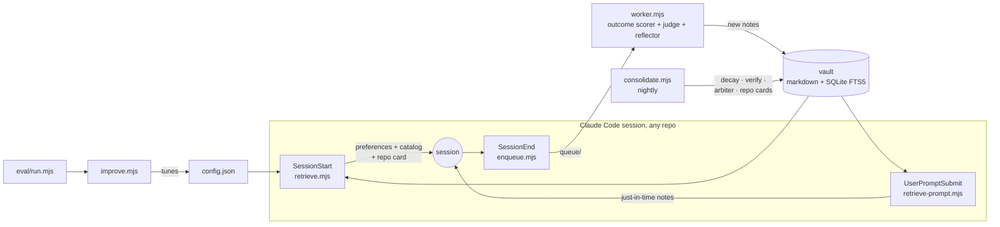

<div align="center">

# unified-mem

**Claude Code remembers per project. unified-mem makes what it learns follow you everywhere: scored by real outcomes, retired when your code moves on.**

[](https://github.com/kirti34n/unified-mem/actions/workflows/ci.yml)
[](https://nodejs.org)
[](LICENSE)

**[Click through the live dashboard](https://kirti34n.github.io/unified-mem/demo-site/)**: the real UI, no install, fictional data.


</div>

## The Tuesday problem

Tuesday. You and Claude spend two hours in your API repo chasing intermittent 401 errors. Turns out parallel requests were racing on token refresh; a Redis lock fixes it. Great session.

Thursday. Different repo, same class of bug. Claude has never heard of Tuesday. It re-explores, re-guesses, re-derives, and you pay for the same two hours again. Claude Code's built-in memory is good, but it is per project by design: what you learn in one repo is invisible in every other.

unified-mem is the layer above: one vault of small markdown notes that every session, in every repo, writes to and reads from. And unlike a notebook, it keeps itself honest: notes earn a usefulness score from real outcomes, fade out when they stop helping, and get re-checked against your actual code when the files they describe change.

## What that means in practice

**You hit a bug someone (you) already solved.** You type "why are these 401s intermittent under load?" and before Claude starts exploring, the note from Tuesday is already in its context: root cause, the exact fix, the commit hash, the gotcha about lock TTLs. Answered in seconds instead of re-derived in hours. In our measured run, one control session dug through a repo for 104 seconds and still failed a question memory answered in 11.

**Your preferences stop needing repetition.** Say "remember that I prefer pnpm" once, in any session. From then on, every session in every repo starts knowing it. Same for your style guide: ingest it once and the right section surfaces exactly when a prompt touches its topic.

**Stale advice retires itself.** That Redis lock note cites `src/auth/token.ts`. The nightly job notices when that file changes, flags the note for review, re-reads the current code, and either restores the note with fresh provenance or retires it. Outdated fixes are the worst failure mode of any memory system; here they become a visible review queue instead of confident misinformation.

**Silence is a feature.** Ask "hey can you fix this thing please" and nothing is injected, on purpose. Research is clear that irrelevant context makes models worse, so unified-mem injects nothing unless a note is genuinely relevant or has proven itself repeatedly. About half of all real sessions get zero notes, and the dashboard shows you that rate.

<details>
<summary><b>See exactly what a session receives</b> (click to expand)</summary>

At session start, a compact map instead of a data dump:

```
Unified cross-repo memory. This is the cold-start catalog; matching notes
auto-load with each prompt, vault_search pulls explicitly, and
vault_remember saves a personal preference.

PERSONAL PREFERENCES (apply in every repo):
- Use pnpm, never npm or yarn, in every project.

MEMORY CATALOG (notes per repo): api-core (4) · web-app (2) · auth-service (1)

THIS REPO, what is there and what is happening:
- branch: main   Recent: fix rate limiter; rotate signing keys
Vault knowledge (4 notes, by usefulness): ...
```

Then, when you type a prompt that matches something the vault knows:

```
Vault notes matching this prompt (verify against current code):

## JWT refresh race causes 401 bursts under load
(repos: api-core · files: src/auth/token.ts · commit: 8f3ab21)
**Problem:** Parallel requests refreshing the same expired JWT raced...
**Fix:** Redis SETNX lock keyed by user-id (commit 8f3ab21). 50ms retry, 5s TTL.
**Gotchas:** Lock TTL must exceed p99 refresh latency.
```

Everything is factual voice with provenance, never instructions, and always labeled to verify against current code.
</details>

## Try it in 60 seconds

```bash
git clone https://github.com/kirti34n/unified-mem && cd unified-mem
node scripts/init.mjs   # your vault: its own git repo, separate from this checkout
node scripts/seed.mjs   # three weeks of demo history to explore
node scripts/dashboard.mjs
```

Open http://localhost:7777 and click through five views: which notes each session received, usefulness scores visibly learning, staleness reviews as red/green diffs, spend against a daily budget, and the abstention rate. Zero npm installs; Node builtins only.

## How it learns, in one minute

A background worker reads each finished session and distills anything durable into a note: one claim, exact error strings and versions preserved verbatim, commit and file provenance attached. Routine sessions produce zero notes, and that is correct.

Then reality grades the notes. When a session ends in a verifiable outcome (tests passed, build green), a pinned judge scores how much each injected note actually contributed, and its usefulness moves:

```
Q ← clamp(Q + α·c·(r − Q))        helpful notes rise toward 0.95
                                  ignored notes decay 5% per idle week
```

Rise enough and a note wins more injections. Decay enough and it is archived. The vault plateaus instead of growing forever, and the whole loop runs on a hard daily budget (default $5) with every LLM call cost-ledgered.

<details>
<summary><b>The machinery diagram</b> (click to expand)</summary>



Retrieval ranks every note by `0.40·similarity + 0.30·usefulness + 0.15·recency + 0.15·validity`, BM25 full text against your prompt and git context, with aggressive relevance floors so nothing irrelevant rides along. Full detail on all eight mechanisms: [docs/MECHANISMS.md](docs/MECHANISMS.md).
</details>

## Make it yours

Three hooks in `~/.claude/settings.json` attach it to every repo you have, and every repo you create later (merge into an existing `"hooks"` block, path where you cloned):

```jsonc
{
  "hooks": {
    "SessionStart": [{ "hooks": [{ "type": "command",
      "command": "node \"/path/to/unified-mem/scripts/retrieve.mjs\"", "timeout": 10 }] }],
    "UserPromptSubmit": [{ "hooks": [{ "type": "command",
      "command": "node \"/path/to/unified-mem/scripts/retrieve-prompt.mjs\"", "timeout": 5 }] }],
    "SessionEnd":   [{ "hooks": [{ "type": "command",
      "command": "node \"/path/to/unified-mem/scripts/enqueue.mjs\"", "timeout": 5 }] }]
  }
}
```

Then turn on the learning loop and, the best part, import the sessions you already had. Your vault starts loaded with months of your own debugging instead of empty:

```bash
node scripts/worker.mjs --watch      # distills finished sessions into notes
node scripts/consolidate.mjs        # nightly upkeep (cron / Task Scheduler lines in the FAQ)
node scripts/backfill.mjs           # mine your PAST session transcripts into notes
node scripts/seed.mjs --purge-demo  # drop the demo data once real notes flow
node scripts/remember.mjs "Prefer pnpm over npm everywhere"   # your first preference
```

Point the `repos` map in `config.json` at your local clones so staleness detection can watch your actual code ([docs/CONFIG.md](docs/CONFIG.md)).

## Prove it to yourself

We measured memory against honest competition: a control arm with full access to the repositories, free to re-derive every answer. Seven questions from real incidents across six repos, two runs each:

| | Memory | Control (repo access, no memory) |
|---|---|---|
| Correct | **14/14 (100%)** | 8/14 (57%) |
| Median latency | 11.9s | 12.1s |
| "I don't know" honesty probe | passed | passed |

Three incidents were only answerable from memory. And the probe matters: memory did not teach the model to fake confidence about things it never learned. This is one vault and 14 samples per arm, a demonstration rather than a benchmark, which is why the harness ships in the box: build questions from your own incidents and run `node eval/run.mjs` ([docs/EVAL.md](docs/EVAL.md)).

## Where it sits

| | scope | learns from outcomes | staleness handling |
|---|---|---|---|
| Claude Code [auto-memory](https://code.claude.com/docs/en/memory) | one repository | no | none |
| [claude-mem](https://github.com/thedotmack/claude-mem) | per project | no | none |
| [memsearch](https://milvus.io/blog/adding-persistent-memory-to-claude-code-with-the-lightweight-memsearch-plugin.md) | past-session search | no | none |
| unified-mem | [all repositories](docs/MECHANISMS.md#the-layering-premise) | [yes, judged and decayed](docs/MECHANISMS.md#3-q-learning-how-usefulness-is-earned) | [git-diff invalidation + re-verification](docs/MECHANISMS.md#4-staleness-the-biggest-accuracy-lever) |

It layers on the built-ins rather than replacing them: instructions stay in CLAUDE.md, project working memory stays in auto-memory, and the reflector is explicitly told to leave project-local context alone.

## Dig deeper

[Mechanisms](docs/MECHANISMS.md) · [Config](docs/CONFIG.md) · [FAQ](docs/FAQ.md) · [Eval methodology](docs/EVAL.md) · [Research](docs/RESEARCH.md) · [Roadmap](docs/ROADMAP.md) · [Design doc](docs/PLAN.md)

## License

[MIT](LICENSE)
