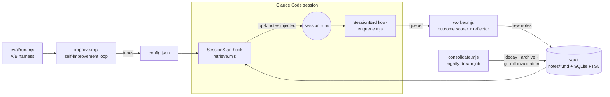

<div align="center">

# 🧠 unified-mem

**A cross-repo evolving memory system for Claude Code.**

Every session starts cold. This fixes that — permanently, across *all* your repositories.

[](#-quickstart)
[](https://nodejs.org)
[](LICENSE)
[](https://code.claude.com)


*The live dashboard: every session, what the vault injected, and the Q-value each note earned from the outcome.*

</div>

---

## 🤔 The problem

1. **Session amnesia** — every Claude Code session starts from zero. Yesterday's debugging is gone.
2. **Cross-repo blindness** — a fix discovered in `repo-A` gets re-discovered from scratch in `repo-B`.
3. **No learning loop** — even where notes exist (CLAUDE.md), nothing measures whether they *help*, and nothing removes what's stale. **Stale memory is worse than no memory.**

## 💡 The idea

A git-versioned markdown vault of atomic knowledge notes that:

- 📥 **captures** — a reflection pass distills each session into typed notes (`recovery` / `strategy` / `optimization` / `decision` / `convention`)
- 📤 **injects** — a SessionStart hook pushes the top-k notes into every new session, ranked by *similarity × learned usefulness × recency × validity*
- 📈 **learns** — notes that help sessions succeed gain Q-value; notes that don't, decay and get archived
- 🕰️ **self-invalidates** — when the code a note describes changes, the note is demoted to `needs-review` instead of silently misleading you
- 📊 **shows you everything** — a zero-dependency live dashboard renders the whole loop, including per-note Q trajectories and Prism-highlighted diffs of every consolidation



## ⚡ Quickstart

Requires Node ≥ 22.5 (`node:sqlite` built in) and the [Claude Code](https://code.claude.com) CLI. **Zero npm installs.**

```bash
git clone https://github.com/kirti34n/unified-mem && cd unified-mem
node scripts/seed.mjs        # demo vault: 3 weeks of fictional history
node scripts/dashboard.mjs   # → http://localhost:7777  (explore all 5 views)
```

Then attach it to every repo by adding two hooks to `~/.claude/settings.json`:

```jsonc
{
  "hooks": {
    "SessionStart": [{ "hooks": [{ "type": "command",
      "command": "node \"/path/to/unified-mem/scripts/retrieve.mjs\"", "timeout": 10 }] }],
    "SessionEnd":   [{ "hooks": [{ "type": "command",
      "command": "node \"/path/to/unified-mem/scripts/enqueue.mjs\"", "timeout": 5 }] }]
  }
}
```

From the next session onward, in **any** repository: knowledge in, knowledge out.

```bash
node scripts/worker.mjs --watch     # background: reflect finished sessions into notes
node scripts/consolidate.mjs       # nightly: decay, archive, invalidate (cron it)
node scripts/backfill.mjs          # optional: mine your PAST session transcripts into notes
node scripts/seed.mjs --purge-demo # remove the demo rows once real data flows
```

## 🖥️ The dashboard

<details>
<summary><b>🕸️ Notes graph</b> — atomic notes linked through shared entities, sized by learned Q-value</summary>
<br>
</details>

<details>
<summary><b>📈 Q evolution</b> — watch usefulness being learned: rising lines help, sagging lines decay</summary>
<br>
</details>

<details>
<summary><b>🌙 Consolidation log</b> — every merge/edit/invalidation as an exact Prism-highlighted diff</summary>
<br>
</details>

<details>
<summary><b>🎯 Metrics</b> — stale-retrieval rate (&lt;5% target), vault size trend (must plateau, not grow)</summary>
<br>
</details>

## 🔬 How it works

<details>
<summary><b>Retrieval ranking</b></summary>

```
score(note) = 0.40·similarity + 0.30·q_value + 0.15·recency + 0.15·validity
```

- **similarity** — SQLite FTS5/BM25 against `{repo, branch, last 5 commit subjects, changed paths}`
- **q_value** — learned usefulness (below)
- **recency** — exponential half-life (default 30 days)
- **validity** — `active 1.0 · needs-review 0.4 · archived 0`

Top-5 notes, ≤2,500 tokens, injected as *"Team knowledge notes… verify against current code"* — factual voice, never imperative. All weights live in `config.json`.
</details>

<details>
<summary><b>Q-learning from outcomes</b></summary>

After each session, the worker detects a **verifiable outcome** (tests passed / build green → `r=1`; failed → `r=0`; unclear → skip) and updates every *injected* note:

```
Q ← clamp(Q + α·c·(r − Q), 0.05, 0.95)     α=0.3, |ΔQ| ≤ 0.15/session
```

where `c` is the note's contribution (did its terms actually surface in the session?). Notes that keep helping rise toward 0.95; unused notes decay `Q·0.95^weeks` and archive below 0.20. Indeterminate sessions never guess rewards.
</details>

<details>
<summary><b>Staleness invalidation — the biggest accuracy lever</b></summary>

Nightly, for every active note: if any file in its `files:` frontmatter changed since `last_validated` (checked via `git log` against your local repos), the note drops to `needs-review` — injected only with an explicit *"verify against code"* warning at 0.4 validity weight. Silent staleness becomes a visible review queue.
</details>

<details>
<summary><b>Note schema — one claim per note, ≤150 words</b></summary>

```yaml
---
id: 2026-06-16-jwt-refresh-race
type: recovery        # strategy | recovery | optimization | decision | convention
title: JWT refresh race causes 401 bursts under load
entities: [auth-service, jwt, redis]
repos: [api-core, auth-service]
files: [src/auth/token.ts, src/middleware/refresh.ts]
source_commit: 8f3ab21
confidence: high
q_value: 0.50         # learned — starts neutral
status: active        # active | needs-review | archived
links: ["[[2026-06-16-redis-lock-pattern]]"]
---
**Problem:** ... **Root cause:** ... **Fix:** ... (commit) **Gotchas:** ...
```

Plain markdown with wikilinks — the whole vault opens in Obsidian.
</details>

<details>
<summary><b>The self-improvement loop</b></summary>

```bash
node scripts/improve.mjs --iterations 5      # or --forever (create a STOP file to halt)
```

`RESEARCH → HYPOTHESIS → IMPLEMENT → TEST → ACCEPT/REVERT → repeat.` Hill-climbs the retrieval tunables (ranking weights, k, half-life, token budget) against the A-arm eval score. Runs as a plain Node process spawning fresh headless `claude -p` calls per test — **no CLI session limit applies**. Every iteration is logged to `improve/log.jsonl`.
</details>

<details>
<summary><b>The A/B eval harness</b></summary>

```bash
node eval/run.mjs --runs 4        # arm A: memory on · arm B: MEMORY_OFF=1
```

Same questions, headless `claude -p`, graded by expect-regex. In this project's own eval, arm A answered **3/3** questions about repos that only exist in vault notes; arm B scored **0/3**. Add your own real questions to `eval/questions.json` — that's what makes the improve loop's decisions meaningful.
</details>

## ⚙️ Config reference

Everything tunable lives in `config.json` (copy `config.example.json`; sensible defaults apply if absent):

| Key | Default | What it does |
|---|---|---|
| `weights` | `.40/.30/.15/.15` | sim / q / recency / validity ranking mix |
| `k` | `5` | notes injected per session |
| `max_inject_chars` | `10000` | ≈2,500-token injection budget |
| `recency_half_life_days` | `30` | recency decay in ranking |
| `decay_factor_per_week` | `0.95` | Q decay on unused notes |
| `archive_below_q` / `archive_unused_days` | `0.20` / `60` | forgetting policy |
| `q_alpha` / `q_delta_cap` / `q_clamp` | `0.3` / `0.15` / `[.05,.95]` | Q-update guardrails (anti-gaming) |
| `reflector_model` / `eval_model` | sonnet / haiku | models for reflection / eval |
| `repos` | `{}` | `name → local path` map that powers git-diff invalidation |

## 📚 Research foundations

Design rules distilled from: **ACE** (evolving playbooks; context-collapse & brevity-bias failure modes) · **MemRL / TAME** (similarity × utility retrieval; contribution-weighted Q updates) · **CODESKILL** (verifiable rewards beat judge-only) · **SCM / Letta** (sleep-time consolidation; ~30% redundancy by session 10 without it) · **SleepGate** (stale-retrieval rate as a first-class metric) · **A-MEM** (Zettelkasten atomic notes). Full citations and the complete design document: [docs/PLAN.md](docs/PLAN.md).

## 🗺️ Roadmap

- [x] Push-path injection, FTS5/BM25 retrieval, injection logging
- [x] Reflection worker + verifiable-outcome Q scorer
- [x] Nightly consolidation: decay · archive · git-diff invalidation · dedupe flagging
- [x] Live dashboard with Prism diff views
- [x] A/B eval harness + self-improvement loop
- [x] Transcript backfill (mine past sessions into notes)
- [ ] Embeddings behind `scoreNotes()` (when FTS5 precision measurably fails)
- [ ] MCP `vault_search` tool for mid-session pull
- [ ] LLM verify-pass for `needs-review` notes; LLM contribution judge
- [ ] Entity hub pages & team sharing via git PRs

## 📄 License

[MIT](LICENSE)
