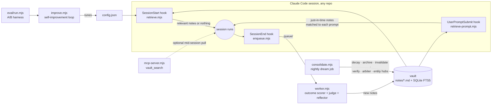

<div align="center">

# 🧠 unified-mem

**The unified memory layer for Claude Code, on top of its per-project memory, across all your repositories.**

Claude Code already remembers *within* a project. This unifies what it learns *across* projects, scored by real outcomes, invalidated when code changes, observable on a live dashboard.

[](#-quickstart-5-minutes)
[](https://nodejs.org)
[](LICENSE)
[](https://code.claude.com)


*The live dashboard: every session, what the vault injected, and the usefulness score each note earned from the outcome.*

</div>

---

## 🧭 What is this, in plain words?

Claude Code is **not** amnesiac, it has [built-in memory](https://code.claude.com/docs/en/memory): each project gets an auto-memory directory that loads every session, `CLAUDE.md` files carry your instructions, and `--resume` continues past conversations. That layer works, and unified-mem does not replace it.

But every project's memory is an **island**. Auto-memory is keyed to one repository, the afternoon you spent fixing a nasty race condition in `repo-A` is invisible to tomorrow's session in `repo-B`. And nothing in the built-in layer *measures* whether a remembered fact still helps, or notices that the code it describes was rewritten last week.

**unified-mem is the shared, self-correcting notebook that sits above all the per-project memories**, one vault that every session, in every repo, writes to and reads from:

- When a session **ends**, a background worker reads the transcript and writes down anything durable it learned, *"this bug had this fix"*, *"this project follows this convention"*, *"this approach worked"*, as small markdown files called **notes**.
- When a new session **starts** (in *any* of your repositories), the most relevant notes are automatically shown to Claude before it begins. It starts the day already knowing what you learned last week, in every repo.
- Over time the system **grades its own notes**. Notes that keep showing up in successful sessions gain a usefulness score (Q-value); notes nobody benefits from fade away and are archived. When the code a note describes gets changed, the note is flagged *"needs review"* and re-verified against the code, so old advice can't silently mislead you. **Stale memory is worse than no memory**, so forgetting is a feature, not a bug.

Everything is observable on a **live dashboard**, you can literally watch what got injected, which notes are earning their keep, and every change the maintenance job makes (shown as red/green diffs).

No databases to install, no npm packages, no cloud. Plain markdown files + Node's built-in SQLite. The vault is a git repo you own.

## 🤔 The problem, precisely

1. **Cross-repo blindness**, built-in memory is per-repository by design. A fix discovered in `repo-A` gets re-discovered from scratch in `repo-B`, `repo-C`, …
2. **No learning loop**, nothing built-in measures whether a remembered fact actually *helps* the work; useful and useless memories are treated identically, forever.
3. **No staleness handling**, nothing notices when the code a memory describes has changed. Stale memory silently misleads, it's worse than no memory.

## 🧩 How it layers on Claude Code's built-in memory

| Layer | Scope | Holds | Learns? | Staleness? |
|---|---|---|---|---|
| [Session transcripts](https://code.claude.com/docs/en/sessions) (`--resume`) | one conversation | full history | no | no |
| [`CLAUDE.md` hierarchy](https://code.claude.com/docs/en/memory) | user / project | your *instructions* | no | manual |
| [Auto-memory](https://code.claude.com/docs/en/memory) | **one repository** | project facts Claude saves | heuristic ("worth remembering") | none |
| **unified-mem** (this) | **all repositories** | durable, verified knowledge | **Q-value from real outcomes** | **git-diff invalidation + re-verification** |

**Division of labor:** project-local, ephemeral context (current task state, repo structure, short-lived plans) stays in the built-in per-project layer where it belongs. Durable, *transferable* knowledge, verified fixes, technology gotchas, patterns, conventions, is promoted into the unified vault. The reflector prompt enforces this split, so the layers complement instead of duplicating: session memory keeps a session coherent; the unified layer makes code generation accurate **everywhere**.



## ⚡ Quickstart (5 minutes)

**Prerequisites:** [Node.js](https://nodejs.org) ≥ 22.5 (`node --version` to check, the built-in SQLite arrived in 22.5) and the [Claude Code CLI](https://code.claude.com). That's it, **zero npm installs**.

**Step 1, See it working before committing to anything.** The demo seeds three weeks of fictional history so every dashboard view has data:

```bash
git clone https://github.com/kirti34n/unified-mem && cd unified-mem
node scripts/seed.mjs        # builds the demo vault
node scripts/dashboard.mjs   # → open http://localhost:7777 and click through the 5 views
```

**Step 2, Attach it to your sessions.** Add two hooks to `~/.claude/settings.json` (create the file if it doesn't exist; if you already have a `"hooks"` section, merge these keys into it). Replace `/path/to/unified-mem` with where you cloned it:

```jsonc
{
  "hooks": {
    "SessionStart": [{ "hooks": [{ "type": "command",
      "command": "node \"/path/to/unified-mem/scripts/retrieve.mjs\"", "timeout": 10 }] }],
    "UserPromptSubmit": [{ "hooks": [{ "type": "command",
      "command": "node \"/path/to/unified-mem/scripts/retrieve-prompt.mjs\"", "timeout": 5 }] }],
    "SessionEnd":   [{ "hooks": [{ "type": "command",
      "command": "node \"/path/to/unified-mem/scripts/enqueue.mjs\"", "timeout": 5 }] }]
  }
}
```

The three hooks: session start seeds broad context from your git state, **each prompt pulls just-in-time notes matched to what you actually asked** (deduplicated against everything already injected, and most prompts correctly pull nothing), and session end queues the transcript for reflection.

Because this lives in your **user-level** settings, it applies to *every* repository automatically, including ones you create next month.

**Step 3, Turn on the learning loop.**

```bash
node scripts/worker.mjs --watch     # keep running: reflects finished sessions into notes
node scripts/consolidate.mjs       # run nightly (cron / Task Scheduler): the "dream job"
```

**Step 4 (optional but recommended), Import your history.** Mine the session transcripts you *already have* into notes, so the vault starts useful instead of empty:

```bash
node scripts/backfill.mjs --per-repo 2   # queue your 2 biggest recent transcripts per repo
node scripts/worker.mjs                  # reflect them into notes
node scripts/seed.mjs --purge-demo       # drop the demo rows, keep only real data
```

**Step 5, Tell the maintenance job where your repos live** (this powers staleness detection). Copy `config.example.json` to `config.json` and fill in the `repos` map:

```jsonc
"repos": { "my-api": "/home/me/code/my-api", "my-app": "/home/me/code/my-app" }
```

That's the whole install. From now on, sessions begin with *"Team knowledge notes from past sessions…"* and end by feeding the vault.

## 📓 What a note looks like

One claim per note, ≤150 words, plain markdown with YAML frontmatter, the whole vault opens in [Obsidian](https://obsidian.md) if you like graphs:

```yaml
---
id: 2026-06-16-jwt-refresh-race
type: recovery        # strategy | recovery | optimization | decision | convention
title: JWT refresh race causes 401 bursts under load
entities: [auth-service, jwt, redis]
repos: [api-core, auth-service]
files: [src/auth/token.ts, src/middleware/refresh.ts]
source_commit: 8f3ab21
confidence: high
q_value: 0.50         # learned usefulness, starts neutral, earned over time
status: active        # active | needs-review | archived
links: ["[[2026-06-16-redis-lock-pattern]]"]
---
**Problem:** Parallel requests refreshing the same expired JWT raced...
**Root cause:** No mutual exclusion around token rotation.
**Fix:** Redis SETNX lock keyed by user-id (commit 8f3ab21). 50ms retry, 5s TTL.
**Gotchas:** Lock TTL must exceed p99 refresh latency.
```

The `files:` + `source_commit` provenance is not decoration, it's what lets the system later detect that the code a note describes has changed.

## 🖥️ The dashboard

Five views, each making one mechanism visible:

<details>
<summary><b>📋 Sessions</b>, what was injected into each session, and the Q-delta each note earned from the outcome</summary>
<br>
</details>

<details>
<summary><b>🕸️ Notes graph</b>, atomic notes linked through shared entities, sized by learned Q-value</summary>
<br>
</details>

<details>
<summary><b>📈 Q evolution</b>, usefulness being learned: rising lines help, sagging lines decay toward archive</summary>
<br>
</details>

<details>
<summary><b>🌙 Consolidation log</b>, every merge/edit/invalidation/verification as an exact red/green diff</summary>
<br>
</details>

<details>
<summary><b>🎯 Metrics</b>, stale-retrieval rate (&lt;5% target), vault size trend (healthy = plateau, broken = linear growth)</summary>
<br>
</details>

## 🔬 How it works (the mechanisms)

<details>
<summary><b>1. Retrieval, which notes get injected?</b></summary>

The design principle: **cold start gets a map, details load on demand.**

- **Session start**: injects a compact **memory catalog** (note counts per repo), plus **this repo's card**, a nightly-generated overview of what the repo is, its recent git activity, and what the vault knows about it, plus only the notes that pass the relevance floor for the current git context. The session begins knowing *what exists and what can be pulled*, not buried under speculative detail.
- **Every prompt** (UserPromptSubmit): the prompt itself is the query, the strongest signal available, injected adjacent to the decision point where models actually use it. Deduplicated against everything already injected this session, behind a **frequency-aware precision gate**: only query terms appearing in ≤30% of notes count as evidence (in a vault of fixes, words like "fix" and "session" match everything and mean nothing), and a note must contain at least two such rare terms. Chatty prompts correctly inject nothing.
- **Explicit pull**: the `vault_search` MCP tool, for when the model or you want to interrogate the vault directly.

All paths apply a **relevance floor**: a note must be topically relevant or have proven high utility, otherwise NOTHING is injected. This is the best-evidenced rule in the memory literature: measured results show even irrelevant-but-plausible extra context degrades task performance, so injecting nothing is the correct default, not a failure.

```
score = 0.40·similarity + 0.30·q_value + 0.15·recency + 0.15·validity
```

- **similarity**, SQLite FTS5/BM25 full-text match (no embeddings needed at this scale)
- **q_value**, the learned usefulness score (see below)
- **recency**, exponential half-life, default 30 days
- **validity**, `active 1.0 · needs-review 0.4 · archived 0` (a needs-review note can still appear, but demoted and explicitly labeled *"verify against code"*)

Top-5 notes, capped at ≈2,500 tokens, written as factual statements, never imperative commands (out-of-band imperative text can trip Claude's prompt-injection defenses). Retrieval is **pushed** by the hook rather than waiting for the model to think of searching, model-initiated recall is unreliable, and injected context is free of per-turn tool-definition overhead.
</details>

<details>
<summary><b>2. Reflection, where notes come from</b></summary>

The SessionEnd hook only *enqueues* (hooks must return in milliseconds). A background worker then reads the transcript and asks a headless Claude to distill it: only durable, reusable knowledge; typed (`recovery`/`strategy`/`optimization`/`decision`/`convention`); one claim per note; commit + files provenance mandatory; secrets forbidden by prompt **and** regex-scanned again before the file is written; near-duplicates suppressed by showing the reflector the 10 nearest existing notes. "Zero notes" is a valid and common outcome, routine sessions produce nothing, and that's correct.

Two rules research says matter most at this step: the reflector must **preserve exact details verbatim** (error strings, versions, thresholds, flags: dropping specifics during distillation is the #1 measured failure mode of memory systems), and it must skip project-local ephemera that Claude Code's built-in per-project memory already owns.
</details>

<details>
<summary><b>3. Q-learning, how usefulness is earned</b></summary>

The worker detects a **verifiable outcome** for each session, tests passed / build green → `r=1`; failed → `r=0`; anything unclear → *no update at all* (never guess rewards). Every note that was injected into that session gets:

```
Q ← clamp(Q + α·c·(r − Q), 0.05, 0.95)      α=0.3, |ΔQ| ≤ 0.15 per session
```

where `c` is a **pinned LLM judge** using a fixed coarse rubric (1 = the note's fix was directly applied, 0.5 = plausibly helped, 0 = ignored), one cheap call per determinate session, judged against the assistant's own output. The model and prompt are pinned deliberately: changing a judge silently makes utility scores incomparable across time. A term-overlap heuristic is the automatic fallback (`contribution_judge: "heuristic"` disables the LLM entirely). Guardrails (clamp, per-session cap, verifiable-outcome anchor, and a deliberately conservative outcome detector, a bare ✓ is not a success signal) keep scores honest. Unused notes decay `Q·0.95^weeks`; below 0.20 and unused 60 days → archived. The vault size **plateaus** instead of growing forever, that trend line is on the Metrics view, and if it's linear, forgetting is broken.
</details>

<details>
<summary><b>4. Staleness, the biggest accuracy lever</b></summary>

Nightly, for every active note: if any file in its `files:` list has commits since the note's `last_validated` (checked with `git log` against your local clones), the note drops to **needs-review**. Then a verification pass reads the *current* code and decides: claims still hold → restored to active with fresh provenance; code moved on → archived, with the reason logged. Every step appears in the Consolidation view as a diff. This converts the worst failure mode of any memory system, confidently applying outdated fixes, into a visible, self-healing review queue.

The same nightly job also runs a **contradiction arbiter** on flagged near-duplicate pairs, classifying each as DUPLICATE (merge manually), UPDATE (one supersedes the other), or COEXISTING (keep both). Research shows mechanical newest-wins rules both fail to retire outdated facts and wrongly merge compatible ones; classification avoids both errors. It regenerates **entity hub pages** (`entities/*.md`), one page per shared concept listing its notes by learned usefulness, which is also what makes the vault's Obsidian graph navigable. And it regenerates the **repo cards** (`repos/*.md`) that power the cold-start injection: per repo, a description pulled from its README, current branch, the last five commits, and the vault's best notes about it, so every new session starts with an accurate picture of what is there and what is happening.
</details>

<details>
<summary><b>5. Mid-session search (optional MCP pull path)</b></summary>

Injection covers session start; for mid-session lookups there's a zero-dependency MCP server exposing `vault_search(query, repo?, k?)`:

```bash
claude mcp add --scope user vault-search -- node /path/to/unified-mem/scripts/mcp-server.mjs
```

Opt-in by design, MCP tool definitions cost tokens in every session, so only register it if you find yourself wanting mid-session recall.
</details>

<details>
<summary><b>6. Measurement, prove it helps, don't assume</b></summary>

```bash
node eval/run.mjs --runs 4        # arm A: memory on · arm B: MEMORY_OFF=1 control
```

Same questions through headless `claude -p`, graded by pinned expect-regex (never an unpinned LLM judge: those silently make scores incomparable over time), reported as correct-rate / tokens / latency medians per arm. Each question can set its own `cwd`, so the control arm gets a fair shot at re-deriving the answer from the repo itself: the comparison then honestly measures *memory vs re-discovery* (correctness, speed, and tokens), not memory vs nothing. Include **negative probes**, questions whose correct answer is "I don't know", to catch a vault that teaches the model to hallucinate confidence. The bundled `questions.json` is demo data wired to the fictional seed notes; write your real set from your own incident history (`eval/questions.real.json` pattern, run with `--file`).
</details>

<details>
<summary><b>7. The self-improvement loop</b></summary>

```bash
node scripts/improve.mjs --iterations 5    # or --forever; create a STOP file to halt
```

`RESEARCH → HYPOTHESIS → IMPLEMENT → TEST → ACCEPT/REVERT → repeat.` Hill-climbs the retrieval tunables (weights, k, half-life, token budget) against the A-arm eval score, one knob at a time. A noise guard rejects same-noise deltas: a change is accepted only if correctness strictly improves, or ties with ≥15% fewer output tokens, run-to-run jitter cannot alter your config. (Ranking weights are also normalized at load, so no config change can break the weighting invariant.) Runs as a plain Node process spawning fresh headless `claude -p` calls, no CLI session limits apply. Every iteration logs to `improve/log.jsonl`. **Use enough eval questions/runs that deltas beat noise**, with 3 questions × 1 run, accept/revert decisions are jitter; ~15 questions × 4 runs is where it gets meaningful.
</details>

## ⚙️ Config reference

Copy `config.example.json` → `config.json` (defaults apply for anything omitted):

| Key | Default | What it does |
|---|---|---|
| `weights` | `.40/.30/.15/.15` | sim / q / recency / validity ranking mix |
| `k` | `5` | notes injected per session |
| `max_inject_chars` | `10000` | ≈2,500-token injection budget |
| `recency_half_life_days` | `30` | recency decay in ranking |
| `decay_factor_per_week` / `decay_after_unused_days` | `0.95` / `7` | Q decay on unused notes |
| `archive_below_q` / `archive_unused_days` | `0.20` / `60` | forgetting policy |
| `q_alpha` / `q_delta_cap` / `q_clamp` | `0.3` / `0.15` / `[.05,.95]` | Q-update guardrails (anti-gaming) |
| `prompt_k` / `prompt_min_sim` | `2` / `0.15` | per-prompt injection count and its aggressive relevance floor |
| `contribution_judge` | `llm` | `llm` = pinned coarse-rubric judge, `heuristic` = term overlap, no LLM calls |
| `reflector_model` | sonnet | model that writes notes (quality matters here) |
| `eval_model` / `verify_model` | haiku | cheap, pinned models for eval, verification, judging |
| `verify_cap` | `5` | max needs-review notes verified per consolidation run |
| `repos` | `{}` | `name → local path` map powering git-diff invalidation |

## 🧯 Troubleshooting & FAQ

<details>
<summary><b>Does this replace CLAUDE.md or auto-memory?</b></summary>

No, it sits on top of them. Keep writing instructions in `CLAUDE.md`; keep auto-memory on (it's per-project working memory and the default since it ships enabled). unified-mem only takes what *transcends* a single project, the reflector is explicitly told to skip project-local ephemera that the built-in layer already owns, and to capture only durable, transferable knowledge. If you disabled auto-memory, unified-mem still works; they're independent.
</details>

<details>
<summary><b>Notes aren't being injected</b></summary>

- Hooks only apply to sessions started *after* editing settings, open a fresh session.
- Test the retriever directly: `echo '{"session_id":"t","cwd":"/path/to/some/repo"}' | node scripts/retrieve.mjs`, you should see notes on stdout.
- `MEMORY_OFF=1` in your environment silences it by design (that's the eval control arm).
- The hook never blocks a session: on any internal error it exits 0 silently. Run the command above manually to surface the error.
</details>

<details>
<summary><b>The worker writes no notes</b></summary>

Usually correct behavior, routine sessions contain nothing durable, and the reflector is told "fewer is better; 0 is valid." It also drops any note matching secret patterns, and skips near-duplicates of existing notes. Check `queue/` is being drained and look at the worker's stdout.
</details>

<details>
<summary><b>Does my code or transcript data leave my machine?</b></summary>

Only through the same channel you already use: headless `claude -p` calls (reflection, verification, eval) go to the same API as your normal Claude Code sessions. Notes never leave the vault directory; the dashboard binds to localhost; there's no telemetry.
</details>

<details>
<summary><b>Won't the vault fill up with junk?</b></summary>

That's what the forgetting machinery is for: reflector selectivity in, decay + archival out, per-repo active cap (default 300), dedupe-candidate flagging in between. Watch the vault-size trend on the Metrics view, plateau is healthy, linear growth means something's off.
</details>

<details>
<summary><b>Can a weird session poison the vault?</b></summary>

Defenses in order: transcripts are wrapped as *data* in the reflector prompt; reflector output passes a **schema gate** (valid id format, title, body, and one of the five allowed types, anything malformed is dropped); notes are written in factual voice (never instructions); secrets are regex-blocked; new notes start at neutral Q and must *earn* influence through successful sessions; injections tell Claude to verify against current code; and everything is a git-tracked markdown file you can diff, revert, or delete. Treat the vault like code, review what lands in it, especially before sharing a vault with a team.
</details>

<details>
<summary><b>Windows notes</b></summary>

Built and tested on Windows 11 (Git Bash present). Hook commands use forward slashes and quoted absolute paths, which work across platforms. For scheduled runs use Task Scheduler:
`schtasks /Create /SC DAILY /ST 03:00 /TN unified-mem-dream /TR "node C:\path\to\unified-mem\scripts\consolidate.mjs"`
</details>

## 📚 Research foundations

The design rules are distilled from published work: **ACE** (evolving playbooks; context-collapse & brevity-bias failure modes, hence incremental note ops, never wholesale rewrites) · **MemRL / TAME** (similarity × utility retrieval; contribution-weighted Q updates) · **CODESKILL** (verifiable rewards beat LLM-judge-only) · **SCM / Letta** (sleep-time consolidation; ~30% redundancy by session 10 without it) · **SleepGate** (stale-retrieval rate as a first-class metric) · **A-MEM** (Zettelkasten-style atomic linked notes beat raw chunks) · **MemFail** (memory systems fail at the write step: over-compression that drops exact details, and bad merge decisions, hence the verbatim rule and the arbiter) · **"Context Length Alone Hurts"** (ACL 2025: even irrelevant filler degrades performance, hence the aggressive relevance floor and inject-nothing default) · **LongMemEval** (abstention ability as a first-class measure, hence negative probes). Full citations and the complete design document: [docs/PLAN.md](docs/PLAN.md).

## 🗺️ Roadmap

- [x] Cold-start catalog + nightly repo cards: sessions start with a map, not a data dump
- [x] Push-path injection, FTS5/BM25 retrieval, injection logging
- [x] Per-prompt just-in-time retrieval (UserPromptSubmit) with session dedupe + frequency-aware precision gate
- [x] Reflection worker + verifiable-outcome Q scorer + pinned LLM contribution judge
- [x] Nightly consolidation: decay · archive · git-diff invalidation · dedupe flagging
- [x] LLM verify-pass: needs-review notes checked against current code, restored or archived
- [x] Contradiction arbiter: dedupe pairs classified duplicate / update / coexisting
- [x] Entity hub pages regenerated nightly
- [x] MCP `vault_search` tool for mid-session pull (opt-in)
- [x] Live dashboard with Prism diff views
- [x] A/B eval harness (per-question cwd, negative probes) + self-improvement loop
- [x] Transcript backfill (mine past sessions into notes)
- [ ] Team sharing via git PRs
- [ ] Embeddings / MMR: deliberately skipped. Measured evidence says BM25 wins on technical vocabulary at this corpus size, and top-k redundancy is near zero with atomic deduped notes. Revisit only if logged retrieval misses accumulate.

## 📄 License

[MIT](LICENSE)
