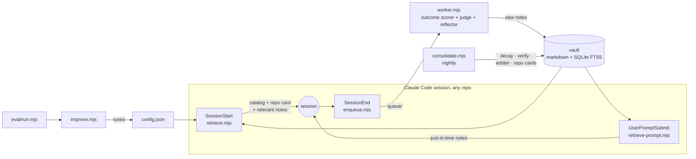

<div align="center">

# unified-mem

**Claude Code remembers per project. unified-mem makes what it learns follow you across every repo, scored by real outcomes, invalidated when code changes.**

[](https://github.com/kirti34n/unified-mem/actions/workflows/ci.yml)
[](https://nodejs.org)
[](LICENSE)

**[Live dashboard demo](https://kirti34n.github.io/unified-mem/demo-site/)**: the real UI, no install, fictional data.


</div>

## Try it in 60 seconds

```bash
git clone https://github.com/kirti34n/unified-mem && cd unified-mem
node scripts/init.mjs   # creates your vault (own git repo, separate from this checkout)
node scripts/seed.mjs   # three weeks of demo history
node scripts/dashboard.mjs
```

Open http://localhost:7777: injections per session, Q-scores learning, staleness reviews as red/green diffs, cost and abstention telemetry. Zero npm installs, `node:` builtins only.

## What you get

- **Cross-repo notes, injected just in time**: a fix discovered in `repo-A` surfaces in `repo-B` exactly when a prompt needs it; chatty prompts correctly inject nothing.
- **Usefulness learned from real outcomes**: notes that keep helping rise; notes that stop contributing decay and are archived.
- **Staleness detection against your actual code**: when a cited file changes, the note is re-verified against the current code and restored or retired.
- **Your preferences and personal docs follow you**: say "remember that I prefer pnpm" (or `npm run remember`), and it is pinned into every future session in every repo; ingested docs surface when a prompt matches them.

## How it works



Every note carries a learned usefulness score, and retrieval ranks by:

```
score = 0.40·similarity + 0.30·q_value + 0.15·recency + 0.15·validity
```

similarity: BM25 match to your prompt or git context · q_value: earned from verified outcomes · recency: 30-day half-life · validity: active 1.0, needs-review 0.4, archived 0.

A background worker distills finished sessions into atomic notes (exact details preserved verbatim, schema-gated, provenance-stamped). A nightly job decays unused notes, re-verifies stale ones against the code they cite, arbitrates near-duplicates, and rebuilds the repo cards that give every session its cold-start map. Full detail: [docs/MECHANISMS.md](docs/MECHANISMS.md).

## Install for real

Add three hooks to `~/.claude/settings.json` (merge into an existing `"hooks"` block), with the path you cloned to:

```jsonc
{
  "hooks": {
    "SessionStart": [{ "hooks": [{ "type": "command",
      "command": "node \"/path/to/unified-mem/scripts/retrieve.mjs\"", "timeout": 10 }] }],
    "UserPromptSubmit": [{ "hooks": [{ "type": "command",
      "command": "node \"/path/to/unified-mem/scripts/retrieve-prompt.mjs\"", "timeout": 5 }] }],
    "SessionEnd":   [{ "hooks": [{ "type": "command",
      "command": "node \"/path/to/unified-mem/scripts/enqueue.mjs\"", "timeout": 5 }] }]
  }
}
```

Then keep the loop running (cron: hourly worker, nightly consolidate; Windows lines in the [FAQ](docs/FAQ.md#windows-notes)):

```bash
node scripts/worker.mjs --watch   # reflects finished sessions into notes
node scripts/consolidate.mjs     # nightly dream job
node scripts/backfill.mjs        # optional: mine your PAST sessions into notes
node scripts/seed.mjs --purge-demo   # drop the demo data once real notes flow
```

User-level hooks mean every repo is attached automatically, including ones you create next month. Point the `repos` map in `config.json` at your local clones to enable staleness detection ([docs/CONFIG.md](docs/CONFIG.md)).

## Does it work?

First real-history result (author's vault: 7 questions from real incidents across 6 repos, 2 runs, control arm free to explore the repos):

| | Memory | Control |
|---|---|---|
| Correct | **14/14 (100%)** | 8/14 (57%) |
| Median latency | 11.9s | 12.1s |
| Negative probe (honest "I don't know") | passed | passed |

Single-vault result, not a benchmark: methodology, caveats, and how to run it on your own history in [docs/EVAL.md](docs/EVAL.md).

## How it compares

| | scope | learning loop | staleness handling |
|---|---|---|---|
| Claude Code [auto-memory](https://code.claude.com/docs/en/memory) | one repository | heuristic save | none |
| [claude-mem](https://github.com/thedotmack/claude-mem) | per project | none | none |
| [memsearch](https://milvus.io/blog/adding-persistent-memory-to-claude-code-with-the-lightweight-memsearch-plugin.md) | search past sessions | none | none |
| unified-mem | [all repositories](docs/MECHANISMS.md#the-layering-premise) | [Q from verified outcomes](docs/MECHANISMS.md#3-q-learning-how-usefulness-is-earned) | [git-diff invalidation + re-verification](docs/MECHANISMS.md#4-staleness-the-biggest-accuracy-lever) |

unified-mem layers on top of the built-ins rather than replacing them: instructions stay in CLAUDE.md, project working memory stays in auto-memory.

## Docs

[Mechanisms](docs/MECHANISMS.md) · [Config](docs/CONFIG.md) · [FAQ](docs/FAQ.md) · [Eval methodology](docs/EVAL.md) · [Research](docs/RESEARCH.md) · [Roadmap](docs/ROADMAP.md) · [Design doc](docs/PLAN.md)

## License

[MIT](LICENSE)
