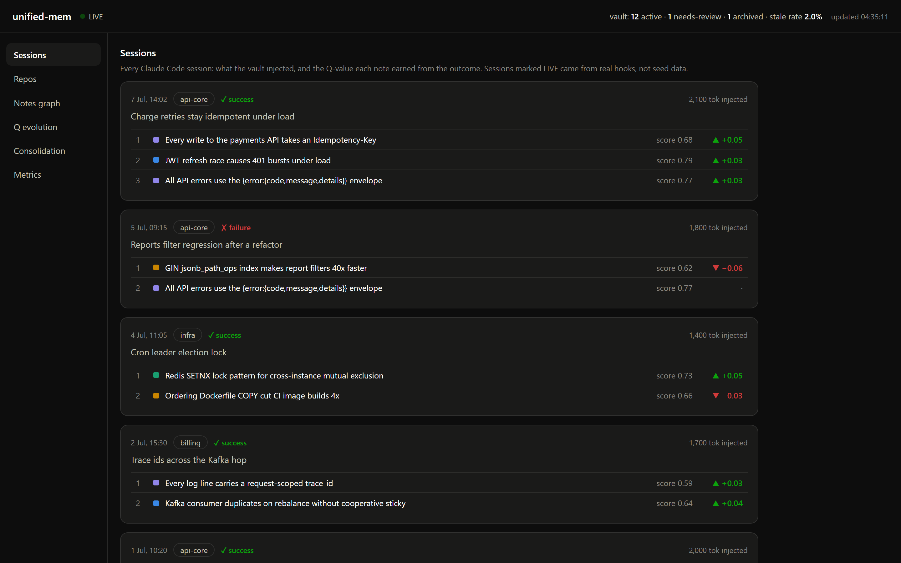
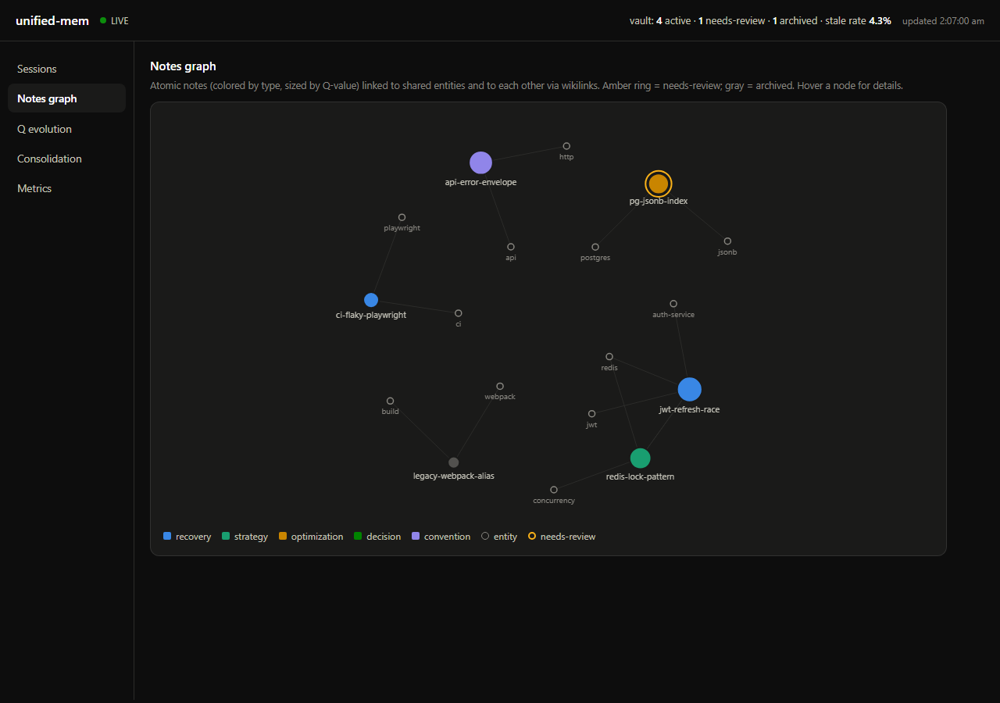
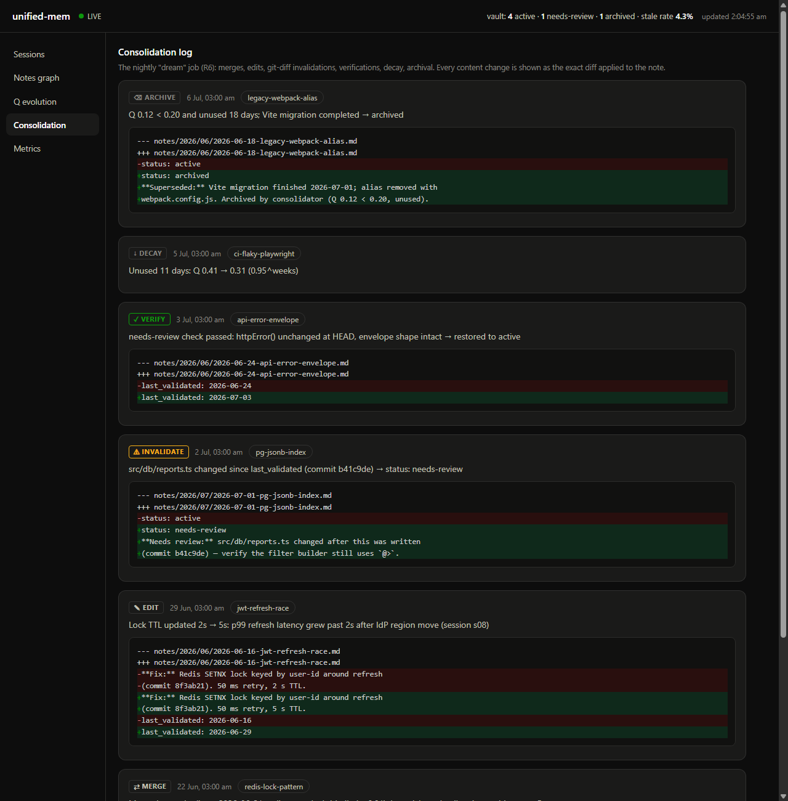

<div align="center">

# unified-mem

**Claude Code remembers per project. unified-mem makes what it learns follow you across every repo: scored by real outcomes, invalidated when your code changes, observable on a live dashboard.**

[](https://github.com/kirti34n/unified-mem/actions/workflows/ci.yml)
[](https://nodejs.org)
[](LICENSE)


**[Click through the live dashboard](https://kirti34n.github.io/unified-mem/demo-site/)**: the real UI, no install, fictional data.



</div>

**Contents:** [Problem](#the-problem) · [What we built](#what-we-built) · [How it helps](#how-it-helps-you) · [How it works](#how-it-works) · [Results](#measured-results) · [Dashboard](#the-dashboard) · [Install](#install) · [Comparison](#how-it-compares) · [Docs](#dig-deeper)

##  The problem

Claude Code ships with good [built-in memory](https://code.claude.com/docs/en/memory): per-project auto-memory that loads each session, the CLAUDE.md instructions hierarchy, and `--resume` for continuing conversations. unified-mem does not replace any of that. It fixes the three things the built-in layer cannot do:

1. **Cross-repo blindness.** Auto-memory is keyed to one repository. The race condition you and Claude spent two hours fixing in `api-core` is invisible tomorrow in `web-app`, so the same class of bug costs the same two hours again. Fixes, gotchas, conventions, and your personal preferences all stop at the repo boundary.
2. **No learning loop.** Nothing measures whether a remembered fact actually helps. A note that saves a session and a note nobody ever benefits from are treated identically, forever. Memory that cannot rank itself eventually injects noise, and measured research shows irrelevant context actively degrades model performance.
3. **No staleness handling.** Nothing notices when the code a memory describes gets rewritten. A remembered fix that no longer matches reality is worse than no memory at all: it gets applied with confidence.

##  What we built

One vault of small markdown notes (one claim each, with commit and file provenance) that every Claude Code session, in every repo, writes to and reads from. Zero dependencies: plain Node builtins plus SQLite full-text search, and the vault is a git repo you own.

| Piece | What it does |
|---|---|
| Four hooks | SessionStart injects a memory catalog, this repo's overview card, and pinned preferences; UserPromptSubmit injects notes matched to what you actually typed; SessionEnd and PreCompact queue the transcript for distillation (PreCompact captures detail mid-session before context is summarized away) |
| Background worker | Distills each finished session into typed notes from a transcript that carries the commands that were run and the edit hunks that were applied, so a note can quote the actual fix rather than the assistant's paraphrase of it. It then scores every injected note against the session's outcome, on the sessions where an outcome can be established |
| Nightly job | Decays unused notes, re-verifies notes whose cited files changed in git, arbitrates near-duplicates, auto-links the knowledge graph, rebuilds repo cards |
| Personal layer | `vault_remember` (MCP tool or CLI) pins your preferences into every session; `ingest.mjs` chunks your own docs so they surface when a prompt touches them |
| Live dashboard | Every injection, every score change, every consolidation as a red/green diff, plus cost and abstention telemetry |
| Eval harness + tuner | An A/B harness measures memory against a no-memory control, and a guarded loop tunes retrieval settings only when a 14+ sample A/B shows a strict correctness improvement |

Where it sits relative to what you already have:

| Layer | Scope | Holds | Learns? | Staleness? |
|---|---|---|---|---|
| [Session transcripts](https://code.claude.com/docs/en/sessions) (`--resume`) | one conversation | full history | no | no |
| [CLAUDE.md hierarchy](https://code.claude.com/docs/en/memory) | user / project | your instructions | no | manual |
| [Auto-memory](https://code.claude.com/docs/en/memory) | one repository | project facts | heuristic | none |
| **unified-mem** | **all repositories** | durable, verified knowledge | **Q-value from outcomes** | **git-diff invalidation + re-verification** |

##  How it helps you

**Solved problems stay solved.** Type "why are these 401s intermittent under load?" and the note from the session that fixed it is in Claude's context before exploration starts: root cause, exact fix, commit hash, the gotcha about lock TTLs. In our measured run, the control arm's slowest miss spent about 90 seconds searching a repo and still got the answer wrong, on a question memory answered from the note in about 12.

**Say a preference once, keep it forever.** "Remember that I prefer pnpm" (mid-conversation via `vault_remember`, or `npm run remember` from a shell) pins that rule into every future session in every repo. Ingest your style guide once and the right section appears exactly when a prompt touches its topic.

**Stale advice retires itself.** Every note cites the files it is about. When those files change, the nightly job flags the note, re-reads the current code with a cheap model, and either restores it with fresh provenance or retires it after two independent stale verdicts. Confident-but-outdated fixes become a visible review queue.

**Useless notes disappear.** When a session ends with a readable outcome, each note that was injected into it has its Q-value moved toward that outcome, weighted by how much the note actually contributed (a pinned judge reads the assistant's own output to decide). Helpful notes rise and win more injections; notes that stop contributing decay 5% per idle week and are archived, so the vault plateaus instead of growing forever.

Being precise about the outcome signal, because it is the part most easily oversold: it is currently read from the transcript, not from a test runner the vault invokes. A session is scored only when its transcript states a result plainly enough to be unambiguous ("14 passed", "build succeeded"); everything else is left as `indeterminate` and produces no Q update at all, on the principle that a guessed reward is worse than none. On this vault that is about 15% of sessions, so Q moves slowly and its influence on ranking is real but modest today. Grounding the reward directly in tool exit status is the next change on the roadmap; until it lands, treat Q as a slow-moving prior rather than a precise utility.

**Irrelevant prompts get silence.** "Hey can you fix this thing please" injects nothing, by design, behind frequency-aware relevance gates. Roughly half of real sessions receive zero notes, the dashboard shows that abstention rate, and prompts about topics the vault does not know are logged as gaps so you can see its blind spots.

**Costs are capped, not hoped about.** Every pipeline LLM call goes through one budget-guarded path with a local cost ledger. Hard daily cap (default $5), cheap-model routing for small jobs, and internal calls can never trigger reflection of themselves.

##  How it works

1. **Capture.** SessionEnd (and PreCompact, mid-session) queues the transcript. The worker distills anything durable into a note: one claim, targeted at 150 words, typed (`recovery`, `strategy`, `optimization`, `decision`, `convention`), schema-gated, secret-scanned, provenance-stamped. Routine sessions produce zero notes, correctly.
2. **Retrieve.** Every note is ranked by `0.40·similarity + 0.30·usefulness + 0.15·recency + 0.15·validity` (BM25 full text against your prompt and git context). Aggressive floors mean nothing rides along unless it is genuinely relevant or has repeatedly proven itself.
3. **Learn.** On a verifiable outcome, each injected note's Q-value moves: `Q ← clamp(Q + α·c·(r − Q))`, where the contribution `c` comes from a pinned judge reading the assistant's own output. Guardrails: per-session delta cap, clamping, no update on ambiguous outcomes, a bare checkmark is not a success signal.
4. **Maintain.** Nightly: git-diff invalidation, two-strike verification, duplicate arbitration (duplicate / update / coexisting), decay, archival, graph auto-linking, entity hubs, repo cards.
5. **Measure.** The A/B harness proves value against a control with full repo access, and the improve loop tunes config only with 14+ samples and above-noise wins.

<div align="center">

</div>

<div align="center"><sub>The learning loop. Green is what the vault earns and injects, amber is nightly maintenance. The diagram is a theme-aware SVG and follows your light or dark GitHub theme.</sub></div>

<details>
<summary><b> Exactly what a session receives</b> (click to expand)</summary>

At session start, a compact map instead of a data dump:

```
Unified cross-repo memory. This is the cold-start catalog; matching notes
auto-load with each prompt, vault_search pulls explicitly, and
vault_remember saves a personal preference.

PERSONAL PREFERENCES (apply in every repo):
- Use pnpm, never npm or yarn, in every project.

MEMORY CATALOG (notes per repo): api-core (4) · web-app (2) · auth-service (1)

THIS REPO, what is there and what is happening:
- branch: main   Recent: fix rate limiter; rotate signing keys
Vault knowledge (4 notes, by usefulness): ...
```

When a prompt matches something the vault knows:

```
Vault notes matching this prompt (verify against current code):

## JWT refresh race causes 401 bursts under load
(repos: api-core · files: src/auth/token.ts · commit: 8f3ab21)
**Problem:** Parallel requests refreshing the same expired JWT raced...
**Fix:** Redis SETNX lock keyed by user-id (commit 8f3ab21). 50ms retry, 5s TTL.
**Gotchas:** Lock TTL must exceed p99 refresh latency.
```

Notes tagged as pitfalls render in a separate block, which the model acts on more reliably than an undifferentiated list:

```
Known pitfalls, do NOT repeat:

## AVOID: proc.terminate() on Windows leaves orphaned child processes
(repos: ci-scripts · files: tests/conftest.py)
**Problem:** terminate() only kills the direct child; grandchildren keep the stdout pipe open and pytest hangs.
**Fix:** kill the whole process tree at fixture teardown (psutil children, recursive).
```

Always factual voice with provenance, never instructions, always labeled to verify against current code. Full detail on all eight mechanisms: [docs/MECHANISMS.md](docs/MECHANISMS.md).
</details>

##  Measured results

Memory versus honest competition: the control arm had full access to the repositories and was free to re-derive every answer. Nine questions (six from real incidents, three negative probes) across five repos, two runs each, graded by pinned regex with hedged "I don't know" non-answers counted as failures:

| | Memory | Control (repo access, unified-mem off) |
|---|---|---|
| Correct | **15/18 (83%)** | 8/18 (44%) |
| Median latency | 12.3s | 11.9s |
| Negative probes (honesty) | 5/6 | 5/6 |

The gap is the point: with full repo access the control re-derived the answer 44% of the time; with the matching note in context, 83%. Three incidents (a Windows kill-by-port fix, a hardcoded date filter, a SQLite busy-timeout) the control failed both attempts and memory answered both. One incident (a PowerShell dollar-swallow bug) neither arm got, because the vault holds no note for it: that is the honest shape of a real memory system, not a 100% headline. Latency is a wash, and memory did not degrade the honesty probes. This is one run of a nine-question, single-vault demonstration, not a field benchmark; the harness ships in the box so you can measure your own history ([docs/EVAL.md](docs/EVAL.md)).

##  The dashboard

<div align="center">

</div>

Six live views at `localhost:7777`, all reading a local, private vault:

-  **Repos**: every repository the memory knows, with per-repo enable/disable (auto-registered on first session)
-  **Sessions**: what each session received and the Q-delta each note earned from the outcome
-  **Notes graph**: atomic notes linked through shared entities, sized by learned usefulness
-  **Q evolution**: usefulness being learned; rising lines help, sagging lines decay toward archive
-  **Consolidation log**: every verification, decay, and merge as an exact red/green diff
-  **Metrics**: stale-retrieval rate, abstention rate, vault size trend, spend against the daily budget

<div align="center">

&nbsp;

</div>

##  Install

**As a plugin (recommended, two commands).** Inside Claude Code:

```
/plugin marketplace add kirti34n/unified-mem
/plugin install unified-mem@unified-mem
```

That wires up all four hooks and the `vault_search` / `vault_remember` MCP tools for every repo, now and in the future. Your vault lives in `~/.unified-mem/vault` (outside the plugin, so it survives updates). Needs Node 22.13+ on your PATH. The plugin covers the in-session parts (inject memory, queue finished sessions); to turn those queued sessions into notes and run nightly upkeep, also start the worker and consolidator (next section, or schedule them per the [FAQ](docs/FAQ.md)).

**Try the dashboard first (60 seconds, no install):**

```bash
git clone https://github.com/kirti34n/unified-mem && cd unified-mem
node scripts/init.mjs   # creates your vault: its own git repo, separate from this checkout
node scripts/seed.mjs   # six weeks of fictional demo history to explore
node scripts/dashboard.mjs   # then open http://localhost:7777
```

<details>
<summary><b>Manual install</b> (without the plugin system)</summary>

Four hooks in `~/.claude/settings.json` cover every repo you have and every repo you create later (merge into an existing `"hooks"` block; use the path you cloned to):

```jsonc
{
  "hooks": {
    "SessionStart": [{ "hooks": [{ "type": "command",
      "command": "node \"/path/to/unified-mem/scripts/retrieve.mjs\"", "timeout": 10 }] }],
    "UserPromptSubmit": [{ "hooks": [{ "type": "command",
      "command": "node \"/path/to/unified-mem/scripts/retrieve-prompt.mjs\"", "timeout": 5 }] }],
    "SessionEnd":   [{ "hooks": [{ "type": "command",
      "command": "node \"/path/to/unified-mem/scripts/enqueue.mjs\"", "timeout": 5 }] }],
    "PreCompact":   [{ "hooks": [{ "type": "command",
      "command": "node \"/path/to/unified-mem/scripts/enqueue.mjs\"", "timeout": 5 }] }]
  }
}
```

The conversational tools are optional (the hooks already inject memory without them). Register the MCP server to add `vault_search` and `vault_remember`:

```bash
claude mcp add --scope user vault-search -- node "/path/to/unified-mem/scripts/mcp-server.mjs"
```
</details>

**Turn on the learning loop, and import your history.** Backfill is the best part: your vault starts loaded with months of your own debugging instead of empty.

```bash
node scripts/worker.mjs --watch      # distills finished sessions into notes
node scripts/consolidate.mjs        # nightly upkeep (init.mjs auto-registers this on Windows; cron in the FAQ)
node scripts/backfill.mjs           # mine your PAST session transcripts into notes
node scripts/starter.mjs            # optional: seed a fresh vault with ~10 real, generic gotchas (trust:seed)
node scripts/seed.mjs --purge-demo  # drop the demo data once real notes flow
node scripts/remember.mjs "Prefer pnpm over npm everywhere"   # your first pinned preference
node scripts/tune-weights.mjs       # optional: once injection history accumulates, fit retrieval weights to it
```

Repos auto-register on their first session (and every hook is user-level), so new and old repos are covered the moment you open Claude Code in them; manage them, including per-repo disable, from the dashboard's Repos view. All pipeline calls (reflection on sonnet, judging and verification on pinned cheap models) go through the Claude CLI: nothing local, nothing separate. Every knob (budgets, floors, models, caps) is documented in [docs/CONFIG.md](docs/CONFIG.md).

##  How it compares

| | scope | learns from outcomes | staleness handling |
|---|---|---|---|
| Claude Code [auto-memory](https://code.claude.com/docs/en/memory) | one repository | no | none |
| [claude-mem](https://github.com/thedotmack/claude-mem) | global store; per-project auto-recall (cross-project via manual search) | no | none |
| [Mem0](https://docs.mem0.ai/integrations/claude-code) (Claude Code plugin) | cross-tool, cloud-first | write-time updates, not outcome-scored | contradiction resolution, not code-aware |
| [memsearch](https://milvus.io/blog/adding-persistent-memory-to-claude-code-with-the-lightweight-memsearch-plugin.md) | per project (sessions + distilled notes) | no | none |
| **unified-mem** | [all repositories](docs/MECHANISMS.md#the-layering-premise) | [judged and decayed](docs/MECHANISMS.md#3-q-learning-how-usefulness-is-earned) | [git-diff invalidation + re-verification](docs/MECHANISMS.md#4-staleness-the-biggest-accuracy-lever) |

Factual and complementary: instructions stay in CLAUDE.md, project working memory stays in auto-memory, and the reflector is explicitly told to leave project-local context alone.

##  Dig deeper

[Mechanisms](docs/MECHANISMS.md) · [Config](docs/CONFIG.md) · [FAQ](docs/FAQ.md) · [Eval methodology](docs/EVAL.md) · [Research](docs/RESEARCH.md) · [Roadmap](docs/ROADMAP.md) · [Design doc](docs/PLAN.md)

##  License

[MIT](LICENSE). Bundled third-party components (PrismJS) are listed in [THIRD-PARTY-NOTICES.md](THIRD-PARTY-NOTICES.md).
