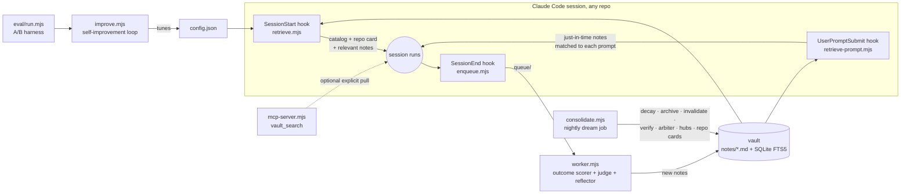
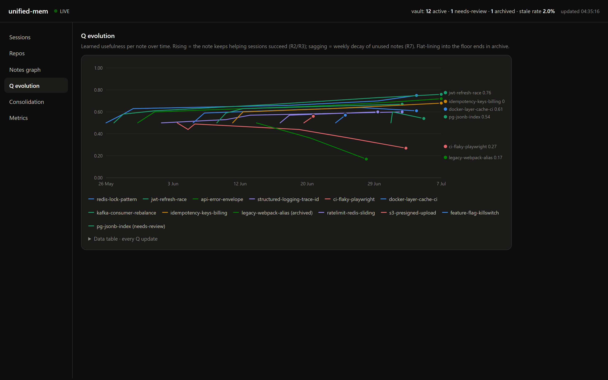
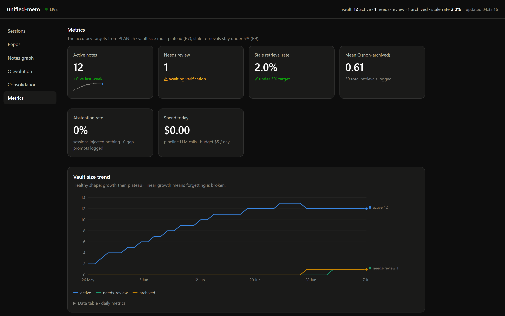

<div align="center">

# unified-mem

**The unified memory layer for Claude Code: on top of its per-project memory, across all your repositories.**

Claude Code already remembers *within* a project. unified-mem unifies what it learns *across* projects: scored by real outcomes, invalidated when code changes, observable on a live dashboard.

[](#quickstart)
[](https://nodejs.org)
[](LICENSE)
[](https://code.claude.com)


*The live dashboard: every session, what the vault injected, and the usefulness score each note earned from the outcome.*

</div>

---

**Contents:** [What is this?](#what-is-this-in-plain-words) · [Does it work?](#does-it-work) · [How it layers on built-ins](#how-it-layers-on-claude-codes-built-in-memory) · [Quickstart](#quickstart) · [Notes](#what-a-note-looks-like) · [Dashboard](#the-dashboard) · [Mechanisms](#how-it-works) · [Config](#config-reference) · [FAQ](#troubleshooting-and-faq) · [Research](#research-foundations) · [Roadmap](#roadmap)

## What is this, in plain words?

Claude Code is not amnesiac. It ships with [built-in memory](https://code.claude.com/docs/en/memory): each project gets an auto-memory directory that loads every session, `CLAUDE.md` files carry your instructions, and `--resume` continues past conversations. That layer works, and unified-mem does not replace it.

But every project's memory is an island. Auto-memory is keyed to one repository, so the afternoon you spent fixing a nasty race condition in `repo-A` is invisible to tomorrow's session in `repo-B`. And nothing in the built-in layer measures whether a remembered fact still helps, or notices that the code it describes was rewritten last week.

**unified-mem is the shared, self-correcting notebook that sits above all the per-project memories.** One vault that every session, in every repo, writes to and reads from:

- When a session **ends**, a background worker reads the transcript and writes down anything durable it learned ("this bug had this fix", "this approach worked", "this is our convention") as small markdown files called **notes**.
- When a session **starts**, in any repository, it receives a compact **catalog** of what the memory holds plus that repo's overview card. When you type a **prompt**, notes matching what you actually asked load just in time. Details arrive on demand, never as a data dump.
- Over time the system **grades its own notes**. Notes that keep contributing to successful sessions gain a usefulness score; notes that stop helping decay and are archived. When the code a note describes changes, the note is flagged for review and re-verified against the current code. Stale memory is worse than no memory, so forgetting is a feature.

Everything is observable on a **live dashboard**: what got injected, which notes are earning their keep, and every change the maintenance job makes, shown as red/green diffs.

No databases to install, no npm packages, no cloud. Plain markdown files plus Node's built-in SQLite. The vault is a git repo you own.

## Does it work?

Measured, not assumed. The bundled A/B harness runs the same questions through headless `claude -p` twice: arm A with memory, arm B without (and arm B is free to dig through the actual repositories). First real-history result from the author's vault, 7 questions drawn from real incidents across 6 repos, 2 runs, 14 samples per arm:

| | Memory | Control (repo access, no memory) |
|---|---|---|
| Correct | **14/14 (100%)** | 8/14 (57%) |
| Median latency | 11.9s | 12.1s |
| Negative probe (honest "I don't know") | passed | passed |

Three incidents were answerable only from memory. One control run spent 104 seconds searching a repo and still failed a question memory answered in 11. The negative probe confirms memory did not induce hallucinated confidence. Single-vault result, not a benchmark: run it on your own history with `node eval/run.mjs`.

## The problem, precisely

1. **Cross-repo blindness.** Built-in memory is per-repository by design. A fix discovered in `repo-A` gets re-discovered from scratch in `repo-B` and `repo-C`.
2. **No learning loop.** Nothing built-in measures whether a remembered fact actually helps the work. Useful and useless memories are treated identically, forever.
3. **No staleness handling.** Nothing notices when the code a memory describes has changed. Stale memory silently misleads, which is worse than no memory at all.

## How it layers on Claude Code's built-in memory

| Layer | Scope | Holds | Learns? | Staleness? |
|---|---|---|---|---|
| [Session transcripts](https://code.claude.com/docs/en/sessions) (`--resume`) | one conversation | full history | no | no |
| [`CLAUDE.md` hierarchy](https://code.claude.com/docs/en/memory) | user / project | your instructions | no | manual |
| [Auto-memory](https://code.claude.com/docs/en/memory) | one repository | project facts Claude saves | heuristic | none |
| **unified-mem** (this) | **all repositories** | durable, verified knowledge | **Q-value from real outcomes** | **git-diff invalidation + re-verification** |

**Division of labor:** project-local, ephemeral context (current task state, repo structure, short-lived plans) stays in the built-in per-project layer where it belongs. Durable, transferable knowledge (verified fixes, technology gotchas, patterns, conventions) is promoted into the unified vault. The reflector prompt enforces this split, so the layers complement instead of duplicating each other: session memory keeps a session coherent, the unified layer makes code generation accurate everywhere.



## Quickstart

**Prerequisites:** [Node.js](https://nodejs.org) 22.5 or newer (`node --version`; the built-in SQLite arrived in 22.5) and the [Claude Code CLI](https://code.claude.com). Zero npm installs.

### Step 1: see it working first

The demo seeds three weeks of fictional history so every dashboard view has data before you commit to anything:

```bash
git clone https://github.com/kirti34n/unified-mem && cd unified-mem
node scripts/seed.mjs        # builds the demo vault
node scripts/dashboard.mjs   # open http://localhost:7777 and click through the 5 views
```

### Step 2: attach it to your sessions

Add three hooks to `~/.claude/settings.json` (create the file if it does not exist; if you already have a `"hooks"` section, merge these keys into it). Replace `/path/to/unified-mem` with where you cloned it:

```jsonc
{
  "hooks": {
    "SessionStart": [{ "hooks": [{ "type": "command",
      "command": "node \"/path/to/unified-mem/scripts/retrieve.mjs\"", "timeout": 10 }] }],
    "UserPromptSubmit": [{ "hooks": [{ "type": "command",
      "command": "node \"/path/to/unified-mem/scripts/retrieve-prompt.mjs\"", "timeout": 5 }] }],
    "SessionEnd":   [{ "hooks": [{ "type": "command",
      "command": "node \"/path/to/unified-mem/scripts/enqueue.mjs\"", "timeout": 5 }] }]
  }
}
```

Session start seeds the catalog and repo card. Each prompt pulls just-in-time notes matched to what you asked (most prompts correctly pull nothing). Session end queues the transcript for reflection. Because this lives in user-level settings, it applies to every repository automatically, including ones you create next month.

### Step 3: turn on the learning loop

```bash
node scripts/worker.mjs --watch    # reflects finished sessions into notes (or run hourly)
node scripts/consolidate.mjs      # the nightly "dream job": run on a schedule
```

Scheduled examples: Windows Task Scheduler

```
schtasks /Create /SC HOURLY /TN unified-mem-worker /TR "node C:\path\to\unified-mem\scripts\worker.mjs"
schtasks /Create /SC DAILY /ST 03:00 /TN unified-mem-dream /TR "node C:\path\to\unified-mem\scripts\consolidate.mjs"
```

or cron: `0 * * * *` for the worker and `0 3 * * *` for the consolidator.

### Step 4 (recommended): import your history

Mine the session transcripts you already have into notes, so the vault starts useful instead of empty:

```bash
node scripts/backfill.mjs --per-repo 2   # queue your biggest recent transcripts per repo
node scripts/worker.mjs                  # reflect them into notes
node scripts/seed.mjs --purge-demo       # remove demo rows AND the fictional demo notes
```

### Step 5: tell the maintenance job where your repos live

This powers staleness detection and the repo cards. Copy `config.example.json` to `config.json` and fill in the `repos` map:

```jsonc
"repos": { "my-api": "/home/me/code/my-api", "my-app": "/home/me/code/my-app" }
```

### Step 6 (optional): register the explicit search tool

```bash
claude mcp add --scope user vault-search -- node /path/to/unified-mem/scripts/mcp-server.mjs
```

Opt-in by design: MCP tool definitions cost tokens in every session, so only register it if you want mid-session recall beyond the automatic per-prompt path.

That is the whole install. Sessions now begin with the memory catalog and end by feeding the vault.

## What a note looks like

One claim per note, at most 150 words, plain markdown with YAML frontmatter. The whole vault opens in [Obsidian](https://obsidian.md) if you like graphs. Example (from the demo seed):

```yaml
---
id: 2026-06-16-jwt-refresh-race
type: recovery        # strategy | recovery | optimization | decision | convention
title: JWT refresh race causes 401 bursts under load
entities: [auth-service, jwt, redis]
repos: [api-core, auth-service]
files: [src/auth/token.ts, src/middleware/refresh.ts]
source_commit: 8f3ab21
confidence: high
q_value: 0.50         # learned usefulness: starts neutral, earned over time
status: active        # active | needs-review | archived
links: ["[[2026-06-16-redis-lock-pattern]]"]
---
**Problem:** Parallel requests refreshing the same expired JWT raced...
**Root cause:** No mutual exclusion around token rotation.
**Fix:** Redis SETNX lock keyed by user-id (commit 8f3ab21). 50ms retry, 5s TTL.
**Gotchas:** Lock TTL must exceed p99 refresh latency.
```

The `files:` and `source_commit` provenance is not decoration. It is what lets the system later detect that the code a note describes has changed.

## The dashboard

Five views, each making one mechanism visible:

<details>
<summary><b>Sessions</b>: what was injected into each session, and the Q-delta each note earned from the outcome</summary>
<br>
</details>

<details>
<summary><b>Notes graph</b>: atomic notes linked through shared entities, sized by learned Q-value</summary>
<br>
</details>

<details>
<summary><b>Q evolution</b>: usefulness being learned; rising lines help, sagging lines decay toward archive</summary>
<br>
</details>

<details>
<summary><b>Consolidation log</b>: every merge, edit, invalidation, and verification as an exact red/green diff</summary>
<br>
</details>

<details>
<summary><b>Metrics</b>: stale-retrieval rate (target under 5%) and the vault size trend (healthy is a plateau; linear growth means forgetting is broken)</summary>
<br>
</details>

## How it works

<details>
<summary><b>1. Retrieval: which notes get injected?</b></summary>

The design principle: **cold start gets a map, details load on demand.**

- **Session start** injects a compact memory catalog (note counts per repo) plus this repo's card: a nightly-generated overview of what the repo is, its recent git activity, and what the vault knows about it. Only notes that pass the relevance floor for the current git context ride along. The session begins knowing what exists and what can be pulled, not buried under speculative detail.
- **Every prompt** (UserPromptSubmit): the prompt itself is the query, the strongest signal available, injected adjacent to the decision point where models actually use context. Deduplicated against everything already injected this session, behind a frequency-aware precision gate: only query terms appearing in at most 30% of notes count as evidence (in a vault of fixes, words like "fix" and "session" match everything and mean nothing), and a note must contain at least two such rare terms. Chatty prompts correctly inject nothing.
- **Explicit pull**: the `vault_search` MCP tool, for interrogating the vault directly.

All paths apply a relevance floor: a note must be meaningfully relevant or have proven high utility, otherwise nothing is injected. This is the best-evidenced rule in the memory literature: measured results show even irrelevant-but-plausible extra context degrades task performance, so injecting nothing is the correct default, not a failure. The Metrics view tracks the abstention rate, and technical prompts that match nothing are logged to `index/gaps.jsonl`: that gap list is the vault's known blind spots, and the only honest evidence base for ever adding embeddings.

```
score = 0.40·similarity + 0.30·q_value + 0.15·recency + 0.15·validity
```

- **similarity**: SQLite FTS5/BM25 full-text match (no embeddings needed at this scale)
- **q_value**: the learned usefulness score (see mechanism 3)
- **recency**: exponential half-life, default 30 days
- **validity**: `active 1.0 · needs-review 0.4 · archived 0` (a needs-review note can still appear, but demoted and explicitly labeled "verify against code")

Injection is capped at roughly 2,500 tokens, written as factual statements, never imperative commands (out-of-band imperative text can trip Claude's prompt-injection defenses). Retrieval is pushed by hooks rather than waiting for the model to think of searching: model-initiated recall is unreliable, and pushed context carries no per-turn tool-definition overhead.
</details>

<details>
<summary><b>2. Reflection: where notes come from</b></summary>

The SessionEnd hook only enqueues (hooks must return in milliseconds), and internal headless calls made by the system itself (verification, judging, evaluation) are never captured, so the reflector cannot feed on its own machinery. A background worker then reads the transcript and asks a headless Claude to distill it: only durable, reusable knowledge; typed (`recovery`/`strategy`/`optimization`/`decision`/`convention`); one claim per note; commit and file provenance mandatory; secrets forbidden by prompt and regex-scanned again before the file is written; near-duplicates suppressed by showing the reflector the ten nearest existing notes; output rejected unless it passes a schema gate. "Zero notes" is a valid and common outcome: routine sessions produce nothing, and that is correct.

Two rules research says matter most here: the reflector must preserve exact details verbatim (error strings, versions, thresholds, flags; dropping specifics during distillation is the top measured failure mode of memory systems), and it must skip project-local ephemera that Claude Code's built-in per-project memory already owns.
</details>

<details>
<summary><b>3. Q-learning: how usefulness is earned</b></summary>

The worker detects a verifiable outcome for each session: tests passed or build green means `r=1`, failures mean `r=0`, anything unclear means no update at all (never guess rewards). Every note that was injected into that session gets:

```
Q ← clamp(Q + α·c·(r − Q), 0.05, 0.95)      α=0.3, |ΔQ| ≤ 0.15 per session
```

where `c` comes from a pinned LLM judge using a fixed coarse rubric (1 means the note's fix was directly applied, 0.5 plausibly helped, 0 ignored), one cheap call per determinate session, judged against the assistant's own output rather than the whole transcript (matching the transcript would reward notes merely for being injected). The judge model and prompt are pinned deliberately: changing a judge silently makes utility scores incomparable across time. A term-overlap heuristic is the automatic fallback, and `contribution_judge: "heuristic"` disables the LLM entirely.

Guardrails keep scores honest: the clamp, the per-session cap, the verifiable-outcome anchor, and a deliberately conservative outcome detector (a bare checkmark is not a success signal). Notes that stop contributing decay by `Q·0.95` per idle week, measured from their last contribution rather than their last injection, so a frequently-retrieved-but-never-helpful note cannot keep itself alive. Below Q 0.20 and unused 60 days, a note is archived. The vault size plateaus instead of growing forever; that trend line is on the Metrics view.
</details>

<details>
<summary><b>4. Staleness: the biggest accuracy lever</b></summary>

Nightly, for every active note: if any file in its `files:` list has commits since the note's `last_validated` (checked with `git log` against your local clones), the note drops to needs-review. A verification pass then reads the current code and decides: claims still hold means restored to active with fresh provenance, code moved on means archived with the reason logged. A 72-hour backoff prevents notes citing hot files from burning the nightly verification budget. Every step appears in the Consolidation view as a diff. This converts the worst failure mode of any memory system, confidently applying outdated fixes, into a visible, self-healing review queue.

The same nightly job also runs a contradiction arbiter on flagged near-duplicate pairs, classifying each as DUPLICATE (merge manually), UPDATE (one supersedes the other), or COEXISTING (keep both); mechanical newest-wins rules both fail to retire outdated facts and wrongly merge compatible ones. It auto-links the knowledge graph with two zero-cost edge types validated by the Obsidian ecosystem, notes citing the same file and notes sharing two or more entities (capped at four links per note so hubs carry the fan-out). And it regenerates entity hub pages (`entities/*.md`) and the repo cards (`repos/*.md`) that power cold-start injection.
</details>

<details>
<summary><b>5. Measurement: prove it helps</b></summary>

```bash
node eval/run.mjs --runs 2        # arm A memory on, arm B MEMORY_OFF=1 control
```

Same questions through headless `claude -p`, graded by pinned expect-regex (never an unpinned LLM judge, which silently makes scores incomparable over time), reported as correct-rate, latency, and output-size medians per arm. Each question can set its own `cwd`, so the control arm gets a fair shot at re-deriving the answer from the repo itself: the comparison honestly measures memory versus re-discovery, not memory versus nothing. Negative probes (questions whose correct answer is "I don't know") catch a vault that teaches the model to hallucinate confidence.

Write your real question set from your own incident history as `eval/questions.real.json`; once it exists it becomes the default for both the harness and the improve loop. The bundled `questions.json` is demo data wired to the fictional seed notes and only runs behind an explicit `--demo` flag. Eval sessions read memory but never mutate retrieval state and are never captured for reflection.
</details>

<details>
<summary><b>6. The self-improvement loop</b></summary>

```bash
node scripts/improve.mjs --iterations 5    # or --forever; create a STOP file to halt
```

Research, hypothesis, implement, test, accept or revert, repeat. The loop hill-climbs the retrieval tunables (ranking weights, k, recency half-life, token budget) against the A-arm eval score, one knob at a time. Three guards keep it honest: it defaults to your real question set (the demo set requires an explicit flag), it refuses to run below 14 samples per measurement (a loop that mutates production config must not decide on jitter), and a noise guard accepts a change only if correctness strictly improves or ties with at least 15% fewer output tokens. Ranking weights are normalized at load, so no accepted change can break the weighting invariant. It runs as a plain Node process spawning fresh headless calls, so no CLI session limit applies, and every iteration is logged to `improve/log.jsonl`.
</details>

<details>
<summary><b>7. Backfill: start with your history, not an empty vault</b></summary>

`node scripts/backfill.mjs` queues your existing Claude Code session transcripts (from `~/.claude/projects/`) through the normal reflection pipeline, so the vault begins loaded with what you already learned. In this project's own backfill, 8 transcripts across 6 repos produced 27 notes: Windows encoding crashes, model-eviction thrash, CI gotchas, architectural decisions, even a user style preference that then correctly surfaced in every repo.
</details>

## Config reference

Copy `config.example.json` to `config.json`; defaults apply for anything omitted.

| Key | Default | What it does |
|---|---|---|
| `weights` | `.40/.30/.15/.15` | similarity / q_value / recency / validity ranking mix (normalized at load) |
| `k` | `5` | max notes injected at session start |
| `max_inject_chars` | `10000` | session-start injection budget (about 2,500 tokens) |
| `start_min_sim` | `0.2` | session-start relevance floor |
| `prompt_k` / `prompt_min_sim` | `2` / `0.15` | per-prompt injection count and floor (plus the rare-term gate) |
| `recency_half_life_days` | `30` | recency decay in ranking |
| `decay_factor_per_week` / `decay_after_unused_days` | `0.95` / `7` | Q decay on idle notes |
| `archive_below_q` / `archive_unused_days` | `0.20` / `60` | forgetting policy |
| `q_alpha` / `q_delta_cap` / `q_clamp` | `0.3` / `0.15` / `[.05,.95]` | Q-update guardrails |
| `contribution_judge` | `llm` | `llm` for the pinned judge, `heuristic` for zero LLM calls |
| `daily_budget_usd` | `5` | hard daily cap on pipeline LLM spend (reflect, judge, verify, arbiter) |
| `max_reflections_per_run` | `10` | reflections per worker drain; excess stays queued for the next run |
| `reflector_model` | sonnet | model that writes notes (quality matters here) |
| `eval_model` / `verify_model` | haiku | cheap pinned models for eval, verification, judging |
| `verify_cap` | `5` | max needs-review notes verified per consolidation run |
| `repos` | `{}` | name-to-local-path map powering invalidation and repo cards |

## Troubleshooting and FAQ

<details>
<summary><b>Does this replace CLAUDE.md or auto-memory?</b></summary>

No. It sits on top of them. Keep writing instructions in `CLAUDE.md`; keep auto-memory on (it is per-project working memory and ships enabled). unified-mem only takes what transcends a single project: the reflector is explicitly told to skip project-local ephemera the built-in layer already owns. If you disabled auto-memory, unified-mem still works; they are independent.
</details>

<details>
<summary><b>Notes are not being injected</b></summary>

Hooks only apply to sessions started after editing settings, so open a fresh session. Test the retriever directly: `echo '{"session_id":"t","cwd":"/path/to/some/repo"}' | node scripts/retrieve.mjs` should print the catalog. `MEMORY_OFF=1` in your environment silences everything by design (that is the eval control arm). The hooks never block a session: on any internal error they exit silently, so run the command above manually to surface the error.
</details>

<details>
<summary><b>The worker writes no notes</b></summary>

Usually correct behavior. Routine sessions contain nothing durable, and the reflector is told "fewer is better; zero is valid." It also drops notes matching secret patterns, rejects anything failing the schema gate, skips near-duplicates, and skips tiny transcripts entirely. Check that `queue/` is being drained and read the worker's stdout.
</details>

<details>
<summary><b>Does my code or transcript data leave my machine?</b></summary>

Only through the channel you already use: headless `claude -p` calls (reflection, verification, judging, eval) go to the same API as your normal Claude Code sessions. Notes never leave the vault directory, the dashboard binds to localhost only, and there is no telemetry.
</details>

<details>
<summary><b>What does this cost to run?</b></summary>

Every pipeline LLM call goes through one budget-guarded path: cost is read from the CLI's own accounting into a local ledger (`index/cost-ledger.jsonl`), the Metrics view shows today's spend against the `daily_budget_usd` cap, and when the cap is reached the pipeline stops calling models until tomorrow (scoring and consolidation code keep running free). Tier routing sends small sessions to haiku and reserves the big reflector model for large transcripts. Per real session with a determinate outcome: one reflection call and one small judge call. Per night: up to `verify_cap` verification calls (with a 72-hour per-note backoff) plus up to three arbiter calls, all haiku. Internal calls are never re-captured, so there are no loops; tiny transcripts are skipped; a worker drain reflects at most `max_reflections_per_run` sessions. Set `contribution_judge: "heuristic"` for zero judge calls.
</details>

<details>
<summary><b>Will the vault fill up with junk?</b></summary>

That is what the forgetting machinery is for: reflector selectivity on the way in, decay and archival on the way out, a per-repo active cap, and dedupe flagging in between. Watch the vault-size trend on the Metrics view: plateau is healthy, linear growth means something is off.
</details>

<details>
<summary><b>Can a weird session poison the vault?</b></summary>

Defenses in order: transcripts are wrapped as data in the reflector prompt; reflector output passes a schema gate (valid id format, title, body, and one of the five allowed types); every note is stamped with provenance by the worker itself, never trusted from LLM output (author, machine, source session, trust class, the consensus defense in the memory-poisoning literature); notes are written in factual voice, never instructions; secrets are regex-blocked; new notes start at neutral Q and must earn influence through verified outcomes; injections tell Claude to verify against current code; and everything is a git-tracked markdown file you can diff, revert, or delete. Treat the vault like code: review what lands in it, especially before sharing a vault with a team.
</details>

<details>
<summary><b>Windows notes</b></summary>

Built and tested on Windows 11 (with Git Bash present). Hook commands use forward slashes and quoted absolute paths, which work across platforms. Task Scheduler one-liners are in the Quickstart.
</details>

## Research foundations

The design rules are distilled from published work. **ACE**: evolving playbooks, context-collapse and brevity-bias failure modes, hence incremental note operations and never wholesale rewrites. **MemRL / TAME**: similarity-times-utility retrieval and contribution-weighted Q updates. **CODESKILL**: verifiable rewards beat judge-only scoring. **SCM / Letta**: sleep-time consolidation (about 30% redundancy by session ten without it). **SleepGate**: stale-retrieval rate as a first-class metric. **A-MEM**: atomic Zettelkasten-style linked notes beat raw chunks. **MemFail**: memory systems fail at the write step through over-compression and bad merges, hence the verbatim rule and the arbiter. **"Context Length Alone Hurts" (ACL 2025)**: even irrelevant filler degrades performance, hence the aggressive relevance floors and the inject-nothing default. **LongMemEval**: abstention ability as a first-class measure, hence negative probes. Full citations and the complete design document: [docs/PLAN.md](docs/PLAN.md).

## Roadmap

- [x] Cold-start catalog plus nightly repo cards: sessions start with a map, not a data dump
- [x] Session-start injection with relevance floor, FTS5/BM25 retrieval, injection logging
- [x] Per-prompt just-in-time retrieval with session dedupe and a frequency-aware precision gate
- [x] Reflection worker with verbatim-detail rule, schema gate, and capture guards against cost loops
- [x] Outcome scorer with pinned LLM contribution judge
- [x] Nightly consolidation: decay, archive, git-diff invalidation, verify-pass with backoff
- [x] Contradiction arbiter: near-duplicate pairs classified duplicate / update / coexisting
- [x] Entity hub pages and repo cards regenerated nightly
- [x] MCP `vault_search` tool for explicit pull (opt-in)
- [x] Live dashboard with Prism diff views
- [x] A/B eval harness (per-question cwd, negative probes, real-set defaults) and gated improve loop
- [x] Transcript backfill
- [x] Cost engineering: per-call ledger, hard daily budget, tier routing, reflection cap per drain
- [x] Auto-linked knowledge graph (co-file and shared-entity edges, no embeddings)
- [x] Telemetry: abstention rate on the dashboard, vault-gap log for unmatched technical prompts
- [x] Provenance stamping on every note (author, machine, session, trust class)
- [ ] Team sharing via git pull requests (recipe validated by research: one-note-per-file, PR gates, machine-local scores in a sidecar)
- [ ] Utilization calibration: citation telemetry plus nightly sampled leave-one-out ablation
- [ ] Embeddings and MMR: deliberately skipped. Measured evidence says BM25 wins on technical vocabulary at this corpus size and top-k redundancy is near zero with atomic deduped notes. Revisit only if logged retrieval misses accumulate.

## License

[MIT](LICENSE)
